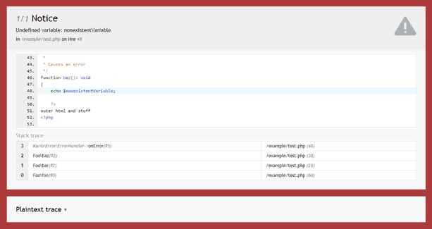

Error handler
#############

Makes handling and debugging PHP errors suck less.

.. image:: https://travis-ci.com/kuria/error.svg?branch=master
   :target: https://travis-ci.com/kuria/error

|Web error screen in debug mode|

.. contents::
   :depth: 2

Features
********

- normal / debug mode
- converts PHP errors (warnings, notices, etc.) into exceptions
- respects the global ``error_reporting`` setting
- handles uncaught exceptions and fatal errors (including parse and out-of-memory errors)
- CLI error screen writes errors to stderr
- web error screen renders errors for web browsers

  - | normal mode shows a generic error message:
    | |Web error screen in normal mode|

  - | debug mode shows all available info:
    | |Web error screen in debug mode|

    - file paths and line numbers
    - highlighted code previews
    - stack traces
    - argument lists
    - output buffer (can be shown as HTML too)
    - plaintext trace (for copy-paste)

- event system that can be utilised to:

  - implement logging
  - suppress or force errors conditionally
  - change or add content to the error screens

Requirements
************

- PHP 7.1+

Usage example
*************

.. code:: php

   <?php

   use Kuria\Error\ErrorHandler;

   $debug = true; // true during development, false in production
   error_reporting(E_ALL); // configure the error reporting

   $errorHandler = new ErrorHandler();
   $errorHandler->setDebug($debug);
   $errorHandler->register();

   // trigger an error to see the error handler in action
   echo $invalidVariable;

Event system
************

Error handler events
====================

Possible events emitted by the ``ErrorHandler`` class are listed in ``ErrorHandlerEvents``:

``ErrorHandlerEvents::ERROR``
-----------------------------

Emitted when a PHP errors occurs.

Arguments:

1. ``Kuria\Error\Exception\ErrorException $exception``

   - you may use the ``suppress()`` or ``force()`` method to suppress or force
     the exception, respectivelly, regardless of the ``error_reporting`` PHP setting

2. ``bool $debug``

``ErrorHandlerEvents::EXCEPTION``
---------------------------------

Emitted when an uncaught exception or a fatal error is being handled.

Arguments:

1. ``Throwable $exception``
2. ``bool $debug``

.. WARNING::

   Avoid performing memory-intensive tasks in listeners of this event if
   ``$exception`` is an instance of ``Kuria\Error\Exception\OutOfMemoryException``.

``ErrorHandlerEvents::FAILURE``
-------------------------------

Emitted when an uncaught exception or a fatal error could not be handled. This can happen
when an ``exception`` event listener or the registered error screen throws an additional
exception. Throwing another exception or causing a fatal error at this point will just
kill the script.

Arguments:

1. ``Throwable $exception``
2. ``bool $debug``

.. WARNING::

   Avoid performing memory-intensive tasks in listeners of this event if
   ``$exception`` is an instance of ``Kuria\Error\Exception\OutOfMemoryException``.

Web error screen events
=======================

Possible events emitted by the ``WebErrorScreen`` class are listed in ``WebErrorScreenEvents``:

``WebErrorScreenEvents::RENDER``
--------------------------------

Emitted when rendering in normal mode.

Receives an array with the following keys:

- ``&title``: used in ``<title>``
- ``&heading``: used in ``<h1>``
- ``&text``: content of the default paragraph
- ``&extras``: custom HTML after the main section
- ``exception``: the exception
- ``output_buffer``: string\|null

``WebErrorScreenEvents::RENDER_DEBUG``
--------------------------------------

Emitted when rendering in debug mode.

Receives an array with the following keys:

- ``&title``: used in ``<title>``
- ``&extras``: custom HTML after the main section
- ``exception``: the exception
- ``output_buffer``: string\|null

``WebErrorScreenEvents::CSS``
-----------------------------

Emitted when CSS styles are being output.

Receives a single boolean value indicating debug mode.

``WebErrorScreenEvents::JS``
----------------------------

Emitted when JavaScript code is being output.

Receives a single boolean value indicating debug mode.

CLI error screen events
=======================

Possible events emitted by the ``CliErrorScreen`` class are listed in ``CliErrorScreenEvents``:

``CliErrorScreenEvents::RENDER``
--------------------------------

Emitted when rendering in normal mode.

Receives an array with the following keys:

- ``&title``: first line of output
- ``&output``: error message
- ``exception``: the exception
- ``output_buffer``: string|null

``CliErrorScreenEvents::RENDER_DEBUG``
--------------------------------------

Emitted when rendering in debug mode.

Receives an array with the following keys:ng keys:

- ``&title``: first line of output
- ``&output``: error message
- ``exception``: the exception
- ``output_buffer``: string|null

Event listener examples
=======================

Logging
-------

Logging uncaught exceptions into a file:

.. code:: php

   <?php

   use Kuria\Debug\Error;
   use Kuria\Error\ErrorHandlerEvents;

   $errorHandler->on(ErrorHandlerEvents::EXCEPTION, function (\Throwable $exception, bool $debug) {
       $logFilePath = sprintf('./errors_%s.log', $debug ? 'dev' : 'prod');

       $entry = sprintf(
           "[%s] %s: %s in file %s on line %d\n",
           date('Y-m-d H:i:s'),
           Error::getExceptionName($exception),
           $exception->getMessage(),
           $exception->getFile(),
           $exception->getLine()
       );

       file_put_contents($logFilePath, $entry, FILE_APPEND | LOCK_EX);
   });

Disabling the "@" operator
--------------------------

This listener causes statements like ``echo @$invalidVariable;`` to throw an exception regardless of the "shut-up" operator.

.. code:: php

   <?php

   use Kuria\Error\Exception\ErrorException;
   use Kuria\Error\ErrorHandlerEvents;

   $errorHandler->on(ErrorHandlerEvents::ERROR, function (ErrorException $exception, bool $debug) {
       $exception->force();
   });

Altering the error screens
--------------------------

.. NOTE::

   Examples are for the ``WebErrorScreen``.

Changing default labels in normal mode:

.. code:: php

   <?php

   use Kuria\Error\Screen\WebErrorScreen;
   use Kuria\Error\Screen\WebErrorScreenEvents;

   $errorScreen = $errorHandler->getErrorScreen();

   if (!$errorHandler->isDebugEnabled() && $errorScreen instanceof WebErrorScreen) {
       $errorScreen->on(WebErrorScreenEvents::RENDER, function ($event) {
           $event['heading'] = 'It is all your fault!';
           $event['text'] = 'You have broken everything and now I hate you.';
       });
   }

Adding a customized section to the debug screen:

.. code:: php

   <?php

   use Kuria\Error\Screen\WebErrorScreen;
   use Kuria\Error\Screen\WebErrorScreenEvents;

   $errorScreen = $errorHandler->getErrorScreen();

   if ($errorHandler->isDebugEnabled() && $errorScreen instanceof WebErrorScreen) {
       // add custom CSS
       $errorScreen->on(WebErrorScreenEvents::CSS, function () {
           echo '#custom-group {color: #f60000;}';
       });

       // add custom HTML
       $errorScreen->on(WebErrorScreenEvents::RENDER_DEBUG, function (array $view) {
           $view['extras'] .= <<<HTML
   

    

        Example of a custom section
    

   

   HTML;
          });
      }

